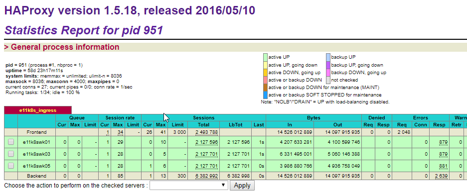
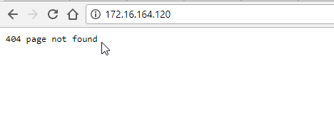
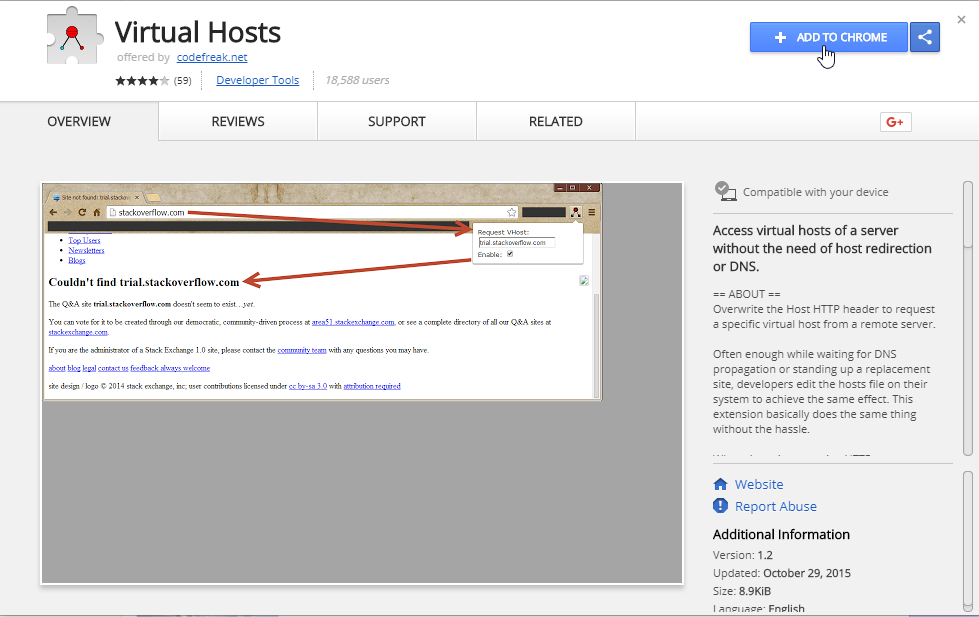
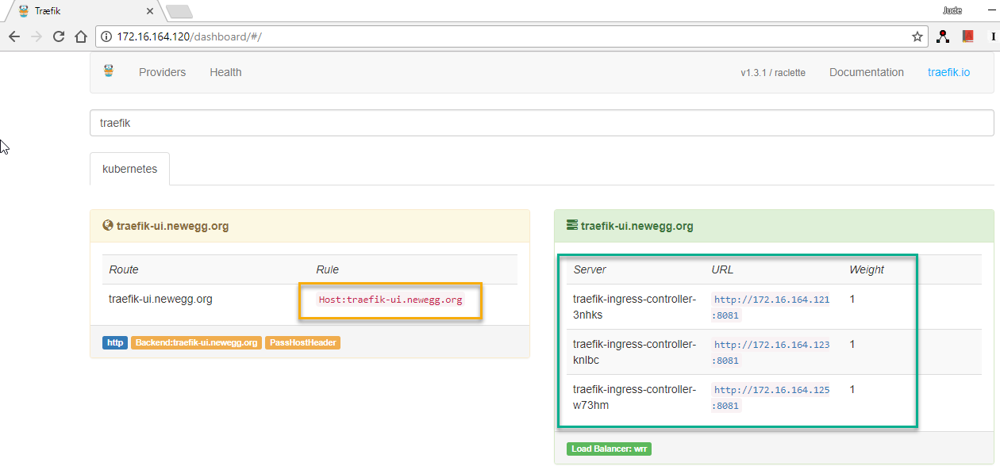
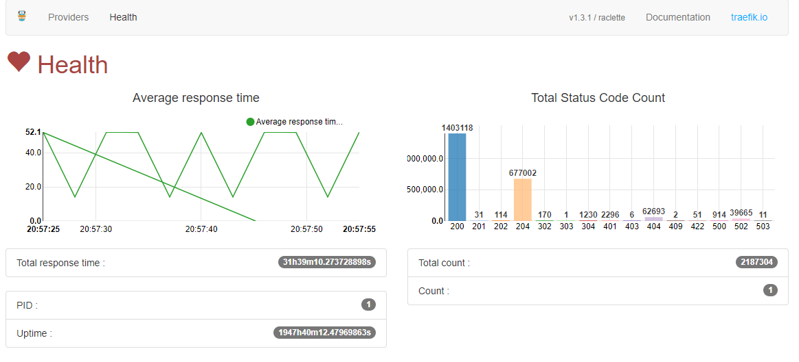
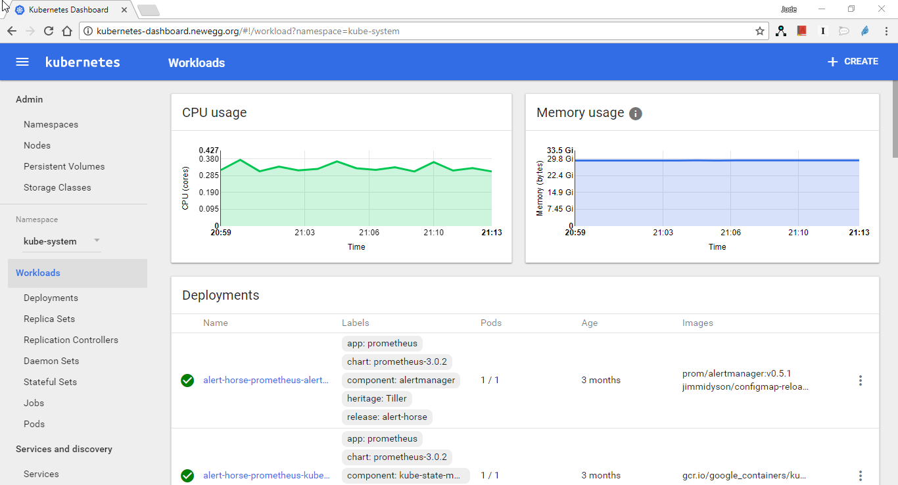

# Kubernetes Tutorials (14)

## Deploy Ingress

Last time we installed the traefik ingress controller.

we used the `nodeSelector` to let the `DaemonSet` Pod only deployed on the `172.16.164.121`, `172.16.164.123` and `172.16.164.125` these 3 nodes.

Let's have a look on the port configuration.

```yaml
        ports:
        - name: http
          containerPort: 80
          hostPort: 80
        - name: admin
          containerPort: 8081
```

From here, we can see we opened 2 `containerPort`, one is 80 and using the `hostPort` mapping and another is 8081 for administrative purpose.

Let's check the `hostPort` by login into the work nodes to check. 

First, let's login into the node E11K8SWK01 `172.16.164.121` which has the label `role=edge-router` and Traefik ingress controller pod deployed, then run `ss -antup | grep 80` to see if the 80 port has been opened on the host level.

```bash
core@e11k8swk01 ~ $ ss -antup | grep 80
tcp    ESTAB      0      0      10.2.80.0:42388              10.2.38.3:3001               
tcp    ESTAB      0      0      10.2.80.0:35792              10.2.110.4:3001               
tcp    ESTAB      0      0      10.2.80.0:55612              10.2.84.3:80                 
tcp    LISTEN     0      128      :::80                   :::*                  
tcp    LISTEN     0      128      :::8081                 :::*                  
tcp    TIME-WAIT  0      0         ::ffff:172.16.164.121:80                    ::ffff:172.16.164.118:39292              
tcp    TIME-WAIT  0      0         ::ffff:172.16.164.121:80                    ::ffff:172.16.164.118:39232              
tcp    TIME-WAIT  0      0         ::ffff:172.16.164.121:80                    ::ffff:172.16.164.118:39622              
tcp    TIME-WAIT  0      0         ::ffff:172.16.164.121:80                    ::ffff:172.16.164.118:39448              
tcp    TIME-WAIT  0      0         ::ffff:172.16.164.121:80                    ::ffff:172.16.164.118:39706              
tcp    TIME-WAIT  0      0         ::ffff:172.16.164.121:80                    ::ffff:172.16.164.118:39184              
tcp    TIME-WAIT  0      0         ::ffff:172.16.164.121:80                    ::ffff:172.16.164.118:39388              
tcp    TIME-WAIT  0      0         ::ffff:172.16.164.121:80                    ::ffff:172.16.164.118:39652              
tcp    TIME-WAIT  0      0         ::ffff:172.16.164.121:80                    ::ffff:172.16.164.118:39124              
tcp    TIME-WAIT  0      0         ::ffff:172.16.164.121:80                    ::ffff:172.16.164.118:39634              
tcp    TIME-WAIT  0      0         ::ffff:172.16.164.121:80                    ::ffff:172.16.164.118:39556              
tcp    TIME-WAIT  0      0         ::ffff:172.16.164.121:80                    ::ffff:172.16.164.118:39400              
tcp    TIME-WAIT  0      0         ::ffff:172.16.164.121:80                    ::ffff:172.16.164.118:39688              
tcp    SYN-RECV   0      0         ::ffff:172.16.164.121:80                    ::ffff:172.16.164.119:41416              
tcp    TIME-WAIT  0      0         ::ffff:172.16.164.121:80                    ::ffff:172.16.164.118:39730              
tcp    TIME-WAIT  0      0         ::ffff:172.16.164.121:80                    ::ffff:172.16.164.118:39568              
tcp    TIME-WAIT  0      0         ::ffff:172.16.164.121:80                    ::ffff:172.16.164.118:39220              
tcp    TIME-WAIT  0      0         ::ffff:172.16.164.121:80                    ::ffff:172.16.164.118:39412              
tcp    TIME-WAIT  0      0         ::ffff:172.16.164.121:80                    ::ffff:172.16.164.118:39454              
tcp    TIME-WAIT  0      0         ::ffff:172.16.164.121:80                    ::ffff:172.16.164.118:39664
```
From the output we can see the 80 port has been opened correctly.

Let's check another node without the label `role=edge-router`, E11K8SWK02 - `172.16.164.122`

```bash
core@e11k8swk02 ~ $ ss -antup | grep 80
core@e11k8swk02 ~ $ 
```

And we can see the 80 port has not been opened.

For I'd like to separate the internal API server traffic and external http/https traffic.

And the internal HAproxys have already taken the port `443`, for future `443` HTTPS traffic using, I've build another two haproxys with IP address `172.16.164.118` and `172.16.164.119`, and the VIP is `172.16.164.120`

Please reference the "Kubernetes Tutorials 05 - Haproxy and Keepalived installation" to build the external service load balance, the configuration almost the same except some small IP address and port change.

Here is the haproxy part configuration

```bash
##---------------------------------------------------------------------
## e11k8s ingress
##---------------------------------------------------------------------
listen e11k8s_ingress
    bind 0.0.0.0:80
    mode http
        balance roundrobin
        server e11k8swk01 172.16.164.121:80 check
        server e11k8swk03 172.16.164.123:80 check
        server e11k8swk05 172.16.164.125:80 check
```

 

For above picture, we can see the load balance works properly.

Remember we opened a containerPort 8081 for traefik administrative purpose, now let's create a ingress to access this service.


### What is ingress?

Ingress gives you a way to route requests to services based on the request ***host or path***, centralizing a number of services into a single entrypoint.

Let's the traefik ingress resource yaml file.

traefik-ingress.yaml

```yaml
apiVersion: v1
kind: Service
metadata:
  name: traefik-web-ui
  namespace: kube-system
spec:
  selector:
    k8s-app: traefik-ingress-lb
  ports:
  - port: 80
    targetPort: 8081
---
apiVersion: extensions/v1beta1
kind: Ingress
metadata:
  name: traefik-web-ui
  namespace: kube-system
  annotations:
    kubernetes.io/ingress.class: traefik
spec:
  rules:
  - host: traefik-ui.newegg.org
    http:
      paths:
      - backend:
          serviceName: traefik-web-ui
          servicePort: 80
```

First, before create our ingress resource, we need create the service for the Traefik ingress controller `DaemonSet` we created recently.

We used the `selecter` to bind them together.

```yaml
spec:
  selector:
    k8s-app: traefik-ingress-lb
```

And mapping the port 80 of the service to the port 8081 of the daemonSet pods.

Then we created a ingress resource with the same name of the services and set the `host` to `traefik-ui.newegg.org`, and set the ingress resource backend to the service `serviceName: traefik-web-ui` port `80`.

Let's create the service and ingress 

```bash 
[root@e11k8sctl01 traefik]# kubectl create -f traefik-ingress.yaml 
service "traefik-web-ui" created
ingress "traefik-web-ui" created
```

Now we've done the deployment part, now let's verify it.

First, let's access with the load balancer VIP address.



Then we have the 404 page not found, what happened here is the ingress like a reverse proxy, you can not directly access it with the IP address, you have to access the service with the `host` which we have set as `traefik-ui.newegg.org`.

To do this, you have 2 ways:
    
    1. You are the owner of the Domain and DNS server, then you can go add the A record of the DNS
    2. Using a small chrome extension named "Virtual Hosts".

Let's do the Second way first.

Go to "Customize and Control Google Chrome" > "More tools" > "Extensions"


The click "Get more extensions" button.

Search "virtual hosts" and install it.



Find the extension , enter your host in the "VHost Domain" and enter your load balancer VIP in the "VHost IP" field, then check the "enable" box.

Then try to access `http://traefik-ui.newegg.org`



With the Virtual hosts extension help, we can access our traefik dashboard now.

ALso we can see some health check information from the health page 



Great ! Now you have your first ingress resource deployed and it looks good.

Let's deploy another for the Kubernetes Dashboard 

Here I will use the first method.

Go the my DNS server and set the DNS A record for my kubernetes Dashboard.


Please note, although the hosts are different , but the IP address is always the same, the VIP address of the load balancer.

Then let's create the kubernetes dashboard ingress resource.

```yaml
apiVersion: extensions/v1beta1
kind: Ingress
metadata:
  name: kubernetes-dashboard
  namespace: kube-system
  annotations:
    kubernetes.io/ingress.class: traefik
spec:
  rules:
  - host: kubernetes-dashboard.newegg.org
    http:
      paths:
      - backend:
          serviceName: kubernetes-dashboard
          servicePort: 80
```

For we already created the kubernetes dashboard service at "Kubernetes Tutorials 12 - Kube-Dasboard", we need only to create the ingress resource here.


```bash
[root@e11k8sctl01 traefik]# kubectl create -f kubernetes-dashboard-ingress.yaml 
ingress "kubernetes-dashboard" created
```

Then try to access `http://kubernetes-dashboard.newegg.org`



Now we success deployed our second ingress resource.

You can create as many ingress resource as you like with just one IP address. 